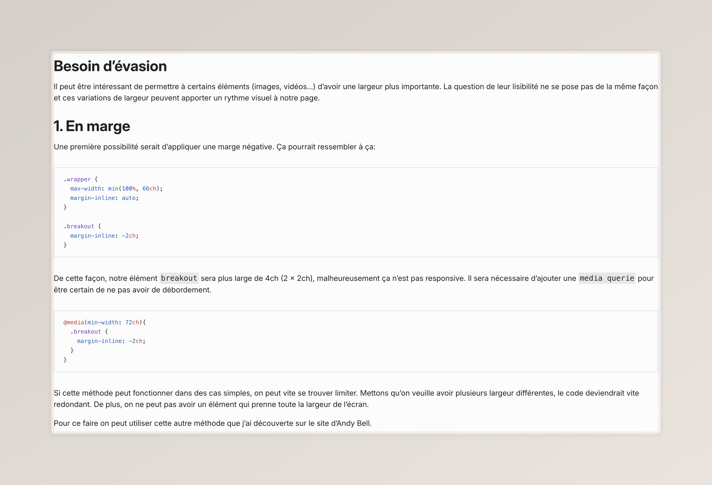
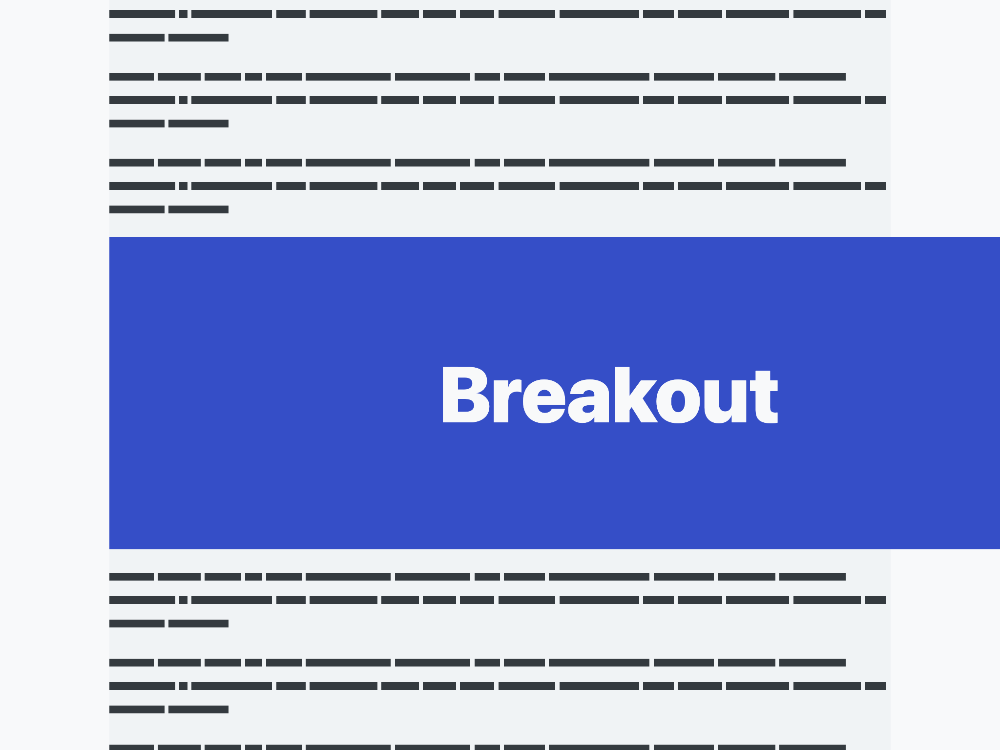
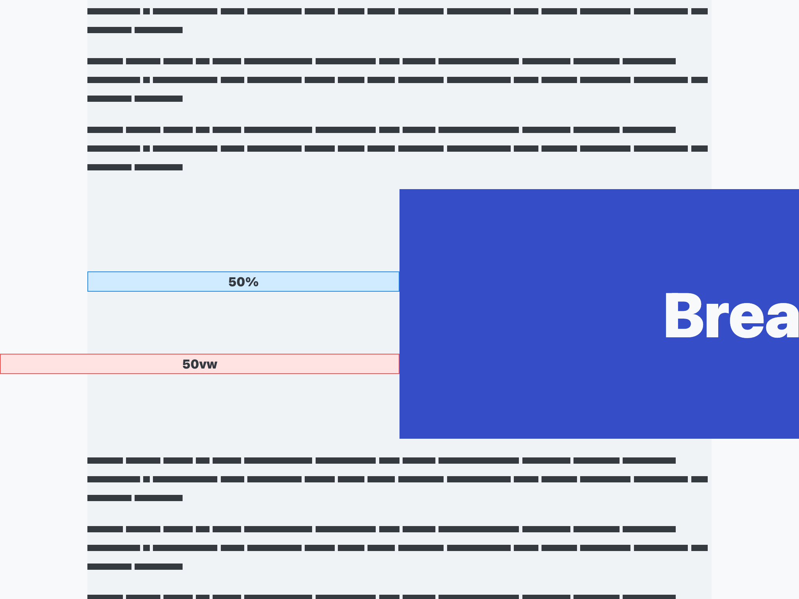
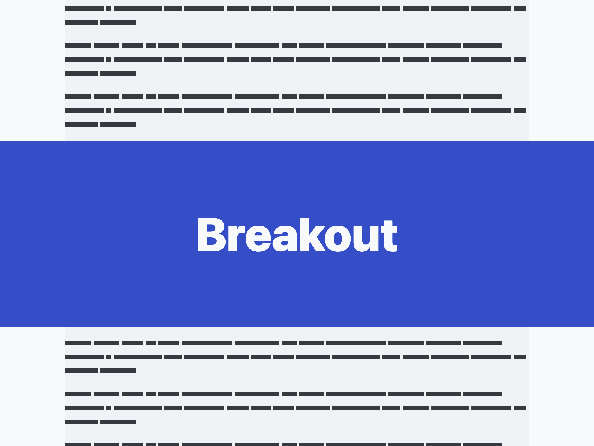
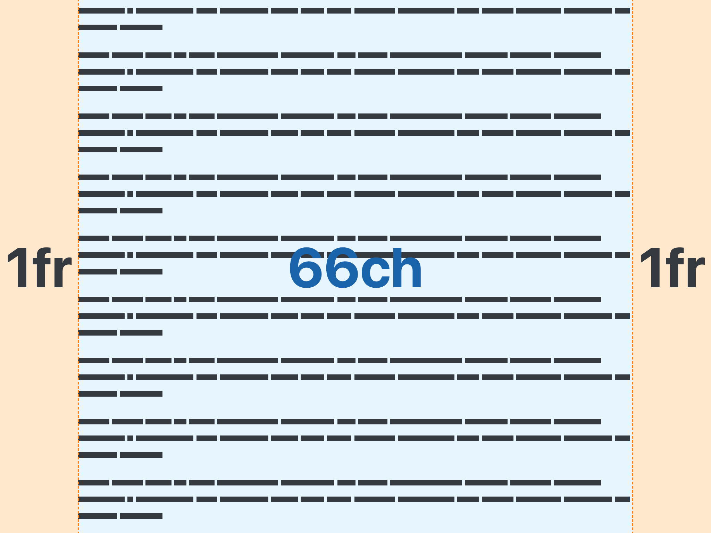

En CSS, on a parfois besoin de permettre à un élément d'être plus grand que son conteneur. Pour ce faire, il existe plusieurs méthodes qui ont chacune leurs avantages et inconvénients.

## Un peu de contexte

*The Elements of Typographic Style* de Robert Bringhurst ~que je n'ai pas lu~ recommande une longueur de ligne comprise entre 45 et 75 caractères.
> On considère généralement qu'une longueur de ligne allant de 45 à 75 caractères est satisfaisante pour une page à une seule colonne avec une police de texte à empattement et une taille de texte standard. Une ligne de 66 caractères (en comptant à la fois les lettres et les espaces) est largement considérée comme idéale.

Je n'ai aucune idée de comment il est arrivé à ces chiffres, mais il semble que cette règle fasse à peu près consensus chez les gens qui se posent la question.

Et force est de constater que des lignes trop longues fatiguent l'œil, en rendant la lecture laborieuse. À l'inverse, des lignes trop courtes perturbent le rythme, car l'œil doit revenir trop souvent à la ligne suivante. 

Voici par exemple à quoi ressemblerait cet article sans que la longueur des lignes ne soient limitées.



Pour contraindre la longueur des lignes, on peut utiliser l'unité `ch`, qui correspond à la largeur d'un caractère `0`.

```css
.wrapper {
  max-width: min(100%, 66ch);
  margin-inline: auto;
}
```

Ainsi, tous les éléments portant la classe `wrapper` auront une largeur maximale de 66 caractères ou, si l'écran est moins large, la largeur de l'écran.

## Besoin d'évasion

Il peut être intéressant de permettre à certains éléments (images, vidéos...) d'avoir une largeur plus importante. La question de leur lisibilité ne se pose pas de la même façon, et ces variations de largeur peuvent apporter un rythme visuel à notre page.

## 1. En marge

Une première possibilité serait d'appliquer une marge négative. Ça pourrait ressembler à ça:

```css
.wrapper {
  max-width: min(100%, 66ch);
  margin-inline: auto;
}

.breakout {
  margin-inline: -2ch;
}
```

De cette façon, notre élément `breakout` sera plus large de 4ch (2 x 2ch), mais malheureusement, ce n'est pas responsive. Il sera nécessaire d'ajouter une `media query` pour être certain de ne pas avoir de débordement.

```css
@media(min-width: 72ch) {
  .breakout {
    margin-inline: -2ch;
  }
}
```

Si cette méthode peut fonctionner dans des cas simples, on peut vite se retrouver limité. Mettons qu'on veuille avoir plusieurs largeurs différentes, le code deviendrait vite redondant. De plus, on ne peut pas avoir un élément qui prenne toute la largeur de l'écran.

Pour ce faire, on peut utiliser cette autre méthode que j'ai découverte sur le site d'Andy Bell.
```css
.breakout {
  width: 100vw;
  margin-left: calc(50% - 50vw);
}
```

En plus de tenir en quelques lignes, elle a l'avantage de ne pas être contraignante. Il est tout à fait possible d'utiliser cette technique sans que cela ne soit prévu à la base.

Le fonctionnement est plutôt simple. On commence par définir une largeur de `100vw`, ainsi l'élément prend la largeur de l'écran, peu importe la largeur de ses parents. Cependant, sa position reste inchangée. Il s'agit donc de ramener son côté gauche au bord de l'écran.



En ajoutant une marge de `50%` (de l'élément parent), le bord gauche de notre élément `breakout` se retrouve au centre de l'écran. On peut ensuite soustraire `50vw`, soit la moitié de la largeur de l'écran.



Et notre élément se retrouve correctement positionné!



Malgré tous ses avantages, cette méthode présente des limites:
- Le conteneur doit être centré.
- Elle provoque un débordement, il faut donc ajouter la règle `overflow-x: hidden;` au body.

## 2. Le joker

S'il fallait résumer notre problème en une phrase, ce serait: *Contraindre la largeur de tous les éléments enfants, sauf ceux qui portent la classe breakout.*

Il se trouve qu'en CSS, cette phrase se dit:

```css
.wrapper > *:not(.breakout) {
  max-width: 800px;
  margin-inline: auto;
}
```

Cette solution est présentée sur le blog de Kilian Valkhof.

Ici, tout tient dans le sélecteur `.wrapper > *:not(.breakout)`
- Le combinateur [`>`](https://developer.mozilla.org/fr/docs/Web/CSS/Child_combinator) permet de sélectionner tous les enfants **directs** de `.wrapper`.
- Le sélecteur [`*`](https://developer.mozilla.org/fr/docs/Web/CSS/Universal_selectors) précise qu'on s'adresse à tout type d'élément.
- La pseudo-classe [`:not`](https://developer.mozilla.org/fr/docs/Web/CSS/:not) précise qu'il faut ignorer les éléments `.breakout`.

Difficile de faire plus simple: c'est lisible, pas de trick étrange et c'est extensible à souhait. Bref, on est proche de la perfection. Néanmoins, cette technique a quelques limites:
1. Impossible d'utiliser l'unité `ch`, les éléments qui ont une taille de police plus grande prendraient plus de largeur.
2. Elle implique que tous les éléments soient des enfants directs de `.wrapper`. Cela peut, par exemple, être problématique avec *Astro*, qui a tendance à envelopper les éléments avec des `<astro-island>` et `<astro-slot>`.

<Aside>
  Lorsque j'utilise cette technique, plutôt que d'utiliser la pseudo-classe `:not`, je préfère utiliser une variable CSS.
  ```css
  .wrapper > * {
    max-width: var(--wrapper-width, 800px);
    margin-inline: auto;
  }
  
  .breakout {
    --wrapper-width: 850px;
  }
  
  .full-width {
    --wrapper-width: 100%;
  }
  ```
</Aside>

## 3. Derrière la grille

Cette dernière méthode est présentée sur le blog de Josh Comeau.

```css
.wrapper {
  display: grid;
  grid-template-columns: 1fr min(100%, 66ch) 1fr;
}

.wrapper > * {
  grid-column: 2;
} 
```

Le principe ici est de créer une grille de 3 colonnes. La colonne centrale prendra une largeur de `66ch` ou de `100%` si la largeur de la page est inférieure à `66ch`. Les deux autres colonnes vont quant à elles se partager l'espace restant.



Il ne reste plus qu'à placer tous les enfants de notre `wrapper` dans la seconde colonne. Si on souhaite qu'un élément utilise toute la largeur de l'écran, il suffit de modifier sa valeur pour `grid-column`:

```css
.breakout{
  grid-column: 1 / -1;
}
```

Ainsi, il commencera à la première colonne et terminera à la dernière (même si on modifie le nombre de colonnes).

Cette méthode est beaucoup plus versatile que les précédentes. Il est possible de complexifier la mise en page en ajoutant des colonnes, par exemple. Il est également possible d'utiliser cette méthode sans que le contenu soit centré. Vous pourriez, par exemple, utiliser une valeur de `2fr` sur la dernière colonne pour que le contenu de la page soit sur la gauche.

Bien sûr, malgré tous ces avantages, il y a quelques défauts:

- C'est subjectif, mais j'ai l'impression qu'on peut vite arriver à un code compliqué et donc moins facile à maintenir.
- L'emploi du `display: grid;` modifie certains comportements "naturels":
  - impossible d'utiliser `display: float;`
  - les marges ne fusionnent plus.

## Quelques ressources utiles

- [**Creating a full bleed CSS utility**, un article *d'Andy Bell*](https://piccalil.li/blog/creating-a-full-bleed-css-utility).
- [**Full bleed layout using simple CSS**, un article de *Kilian Valkhof*](https://kilianvalkhof.com/2020/css-html/full-bleed-layout-using-simple-css/)
- [**Full-Bleed Layout Using CSS Grid**, un article de Josh Comeau](https://www.joshwcomeau.com/css/full-bleed/)
- [**Layout breakouts**, un article de *Ryan Mulligan*](https://ryanmulligan.dev/blog/layout-breakouts/)
- [**A new approach to container and wrapper classes** une vidéo de *Kevin Powell*](https://www.youtube.com/watch?v=c13gpBrnGEw)
- [**Smol Breakout Grid**, un article de *Stephanie Eckles*](https://smolcss.dev/#smol-breakout-grid)
