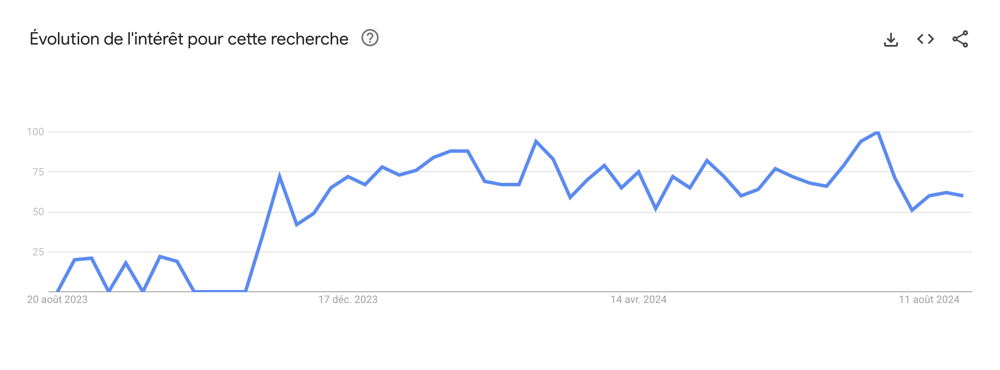

Les grilles bento sont à la modes. Elles seraient inspirées de ces boîtes japonaises servant à transporter des repas individuels. Ces coffrets grâce à leurs compartiments permettent de transporter une portion composée de diverses préparations cuisinées.


Que ce soit pour des slides, des apps ou des sites, on voit de ces grilles un peu partout. D'ailleurs les résultats de **Google Trends** pour les recherches de "bento grid" ces 12 derniers mois sont assez édifiants.



La promesse est alléchante:
- **Modularité**: La division en blocs de tailles variables, permet une flexibilité dans l'organisation du contenu.
- **Équilibre**: Comme dans un bento, chaque bloc est conçu pour maintenir un équilibre visuel, évitant une surcharge d'informations dans un seul compartiment.
- **Esthétique**: L'apparence générale est propre, minimaliste et bien ordonnée.
- **Efficacité**: L'ensemble des informations est condensé dans un minimum d'espace.

## Coder

Seulement, est-ce que ce type de mises en pages est réellement compatibles avec la multitude de tailles d'écran qui existent aujourd'hui ? Certe les `Grilles Css` existent et sont largement supportées par les navigateurs, mais combien de `media queries` faut-il pour que ce genre de design s'adapte aux dimensions des écrans? Et quand bien même on arriverait à rendre le tout responsive, on devrait recommencer à chaque modification de contenu?

J'en fais sûrement un peu trop. Tout ça pour dire que c'est un peu plus dur que ça en a l'air et que les `Grilles Css` ne sont, à mon avis, pas solution que l'on va exploré aujourd'hui.

Voici la grille que l'on va développer:


Et voici notre cahier des charges:
- La grille doit *naturellement* s'adapter à la taille de l'écran.
- La grille doit s'adapter à la taille du contenu.
- Le CSS doit pouvoir fonctionner pour des grilles différentes.

Pour commencer nous allons nous attaquer aux rangées du type de celle-ci: 


Voici à quoi ressemblera notre markup.

```html
<div class="row">
    <div>1</div>
    <div>2</div>
    <div>3</div>
    <div>4</div>
    <div>4</div>
</div>
```

```css
.row {
    display: flex;
    flex-wrap: wrap;
    gap: 16px;
}

.row > * {
    flex-grow: 1;
}
```

On utilise seulement quatre propriétés css, mais c'est sur elles que reposent tout le code que l'on va voir.

- `display: flex`: indique que les enfants directs de `row` doivent se partager l'espace disponible.
- `flex-wrap: wrap`: indique que si les enfants directs de `row` n'ont pas assez de places pour être allignés, ils doivent utiliser la ligne suivante.
- `gap: 16px`: indique que les enfants directs de `row` doivent être espacés de `16px`, horizontalement et verticalement.
- le sélecteur `.row > *`: inidque que l'on s'adresse aux enfants directs de `.row`.
- `flex-grow: 1`:  indique que les éléments doivent grossir jusqu'à prendre tout l'espace disponible.

<Aside>
Tous le code "esthétiques" est omis pour plus de lisibilité. Si vous souhaitez voir le code complet vous trouverez un **codepen** à la fin du texte.
</Aside>

Pour ce qui est des colonnes, c'est encore plus simple. On vas simplement créer un élément `col`, qui contiendra nos éléménents `row`.

```html
<div class="col">
    
</div>
```

```css
.col{
    display: flex;
    flex-direction: column;
    gap: 16px;
}
```

La seule nouveauté ici est l'utilisation de `flex-direction: column` qui indique que les enfant de `col` doivent être disposés en colonne.

Et voilà! On a tout le css dont on a besoin. Si nécessaire on pourra imbriquer les `col` dans les `row` pour donner l'impression que des cellules sont divisées en deux rangées.

```html
<div class="col">
    <div class="row">
        <div>1-A</div>
        <div class="row">
            <div>1.1-B</div>
            <div>1.2-B</div>
        </div>
        <div>2.C</div>
    </div>
    <div class="row">
        <div>2.A</div>
        <div>2.B</div>
    </div>
    <div class="row">
        <div>3.A</div>
        <div>3.B</div>
        <div>3.C</div>
        <div>3.D</div>
    </div>
</div>
```

<PenEmbed url="https://codepen.io/charleskaito/pen/WNqMoYa"/>
